# System Map

*What we're building, how the pieces connect, and what's real vs. simulated.*

This document is for builders. The brief answers why this should exist. The whitepaper explains how the mechanism works. This answers: **what are we building and where is each piece right now?**

---

## The Loop

A project launches a token. Trading generates fees. Those fees fund governance. Governance produces decisions. Good decisions attract more trading. More trading funds better governance.

```
trading volume
  → fees → emissions pool grows
    → bigger bounties → more deliberation participation
      → better decisions → higher confidence signal
        → more trading volume
```

The claim — and what the simulation has to prove — is that this loop is self-sustaining: governance generates more value than it costs to run.

---

## The Full Sequence

```mermaid
sequenceDiagram
    participant Trader
    participant MarketAMM as Market AMM
    participant Pool as Emissions Pool
    participant Worker
    participant WorkSDK as Work SDK
    participant Proposals
    participant AnodeAMM as Anode AMM
    participant Agents
    participant Facilitator
    participant Settlement
    participant Executor

    rect rgb(25, 50, 120)
        Note over Trader, Pool: Capital Formation
        Trader->>MarketAMM: buy(USDC)
        MarketAMM-->>Trader: cathode tokens
        MarketAMM->>Pool: 40% fee → compound
        MarketAMM-->>Creator: 50% fee → liquid revenue
        Pool->>Pool: auto-compound LP position
    end

    rect rgb(90, 60, 0)
        Note over Worker, Proposals: Work
        Worker->>WorkSDK: report work (Customer / Provable)
        WorkSDK-->>Worker: emissions minted (decay curve)
        Worker->>Proposals: submit qualitative work
        Agents->>Proposals: upvote / downvote
        Proposals->>Proposals: net votes ≥ threshold
    end

    rect rgb(10, 75, 45)
        Note over Proposals, Settlement: Deliberation
        Proposals->>AnodeAMM: open deliberation
        Pool->>AnodeAMM: fund bounty (cathode from treasury)
        Agents->>AnodeAMM: buy anode (cathode in → anode out)
        Agents->>AnodeAMM: speak (anode → speaking pool)
        Agents->>AnodeAMM: vote for speaker (anode → voting pool)
        Note over Facilitator: real agents — optional
        Facilitator->>Agents: manage turns, extract claims
        Agents->>Facilitator: responses (claims, positions, votes)
        Note over AnodeAMM: N idle rounds → settle
        AnodeAMM->>Settlement: trigger settlement
        Settlement-->>Agents: winner: speaking pool + bounty share
        Settlement-->>Agents: winning voters: voting pool + bounty share
        Settlement-->>Worker: proposer reward
        Settlement-->>Agents: others: anode discharged → cathode (fee taken)
    end

    rect rgb(90, 15, 15)
        Note over Settlement, Executor: Execution — not yet built
        Settlement->>Executor: decision + quality score
        Executor->>Worker: pay / commission / reject
        Executor-->>Pool: quality signal → buy pressure
        Pool->>MarketAMM: increased trading volume
    end
```



---

## Where Each Piece Lives

| Component | Fast Sim | Real Agents | Not Yet Built |
|-----------|----------|-------------|---------------|
| Market AMM / bonding curve | ✓ `/emitter/runs` | — | on-chain contracts |
| Fee split (40/50/10) | ✓ | — | on-chain contracts |
| Emissions pool compounding | ✓ | — | on-chain contracts |
| Customer / Provable Work | ✓ | — | SDK integrations |
| Qualitative Work submission | ✓ `/runs` | — | — |
| Proposal voting / threshold | ✓ `/runs` | — | — |
| Anode AMM (pricing, pools) | ✓ `/runs` | — | — |
| Deliberation economics (speak/vote/settle) | ✓ `/runs` | — | — |
| Claim content + reasoning quality | bots (stochastic) | to build | — |
| Facilitator (turn management) | — | ✓ `/deliberate` | — |
| Adversarial analysis | ✓ `/runs` | — | — |
| Emitter ↔ Governance bridge | planned | — | — |
| Execution (decision → action) | — | — | to build |
| Quality signal → market feedback | planned | — | — |

---

## Two Simulation Layers

**Layer 1 — Fast Sim**
Stochastic bots, Monte Carlo over parameter space. Runs in the browser in seconds, costs nothing. Answers: *does the mechanism math work?* Used for parameter exploration and adversarial analysis. Lives in `/runs` (governance) and `/emitter/runs` (launchpad).

**Layer 2 — Real Agents**
Actual Claude instances with isolated context, economic stakes, and MCP tools to interact with the simulation state. Runs slowly and costs money. Answers: *does the mechanism change how agents actually reason?* The interesting finding is the gap between what Layer 1 predicted and what Layer 2 actually produced.

The Facilitator (`/deliberate`) is the coordination layer for Layer 2 — it manages turn-taking, extracts claims, tracks votes, calls settlement. It's a referee, not a player.

---

## The Key Number

**Self-funding ratio** = additional trading volume attributable to governance / total governance cost

- `> 1.0` — governance pays for itself. The loop is self-sustaining.
- `< 1.0` — governance is subsidized. The loop needs external funding to run.

Everything in the simulation is infrastructure to produce this number under realistic conditions.

---

## What Gets Updated Here

This document is a living reference. When a component moves from "to build" to "built," update the table. When the sequence changes, update the diagram. When the self-funding thesis changes, update the key number section.

The brief and whitepaper are versioned and archived. This document just reflects current reality.
