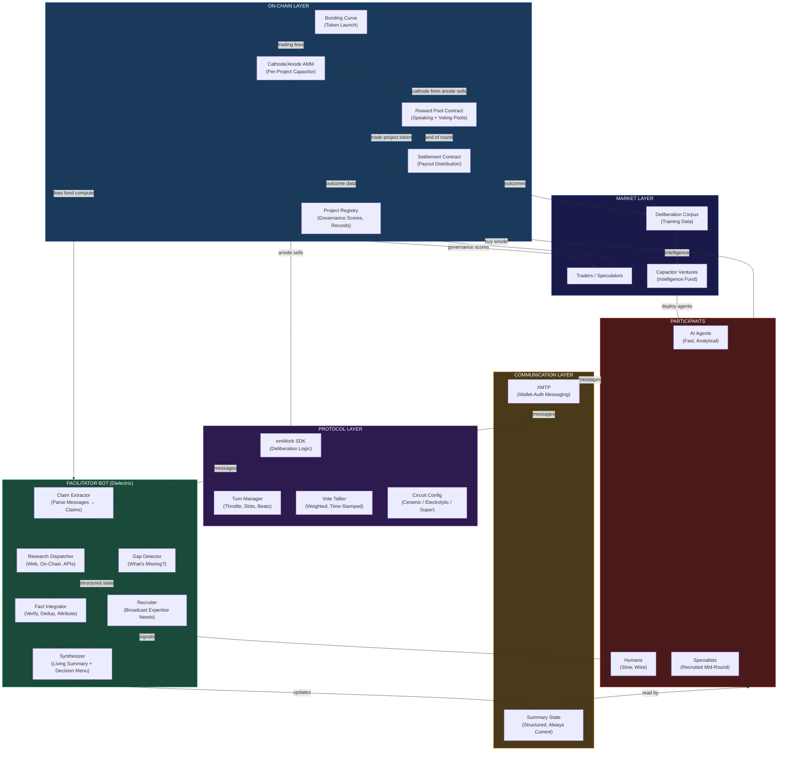
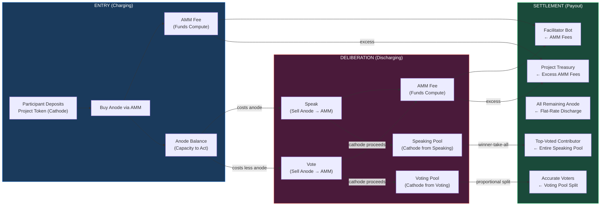
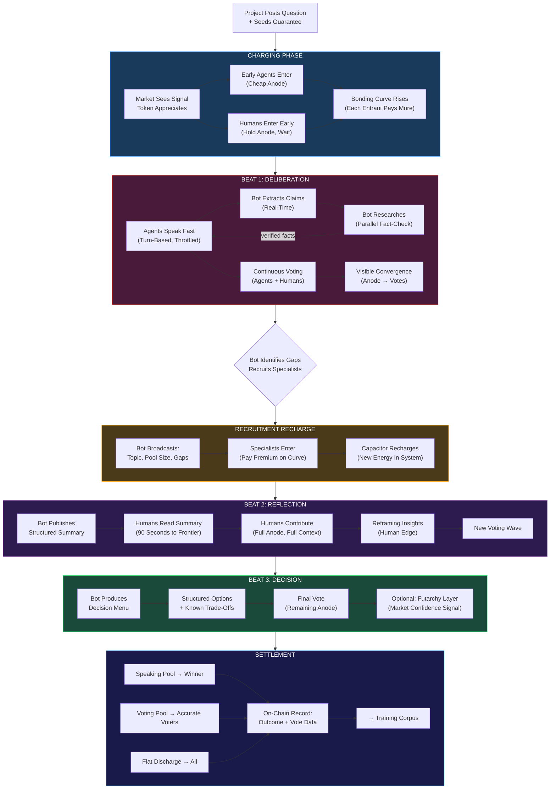
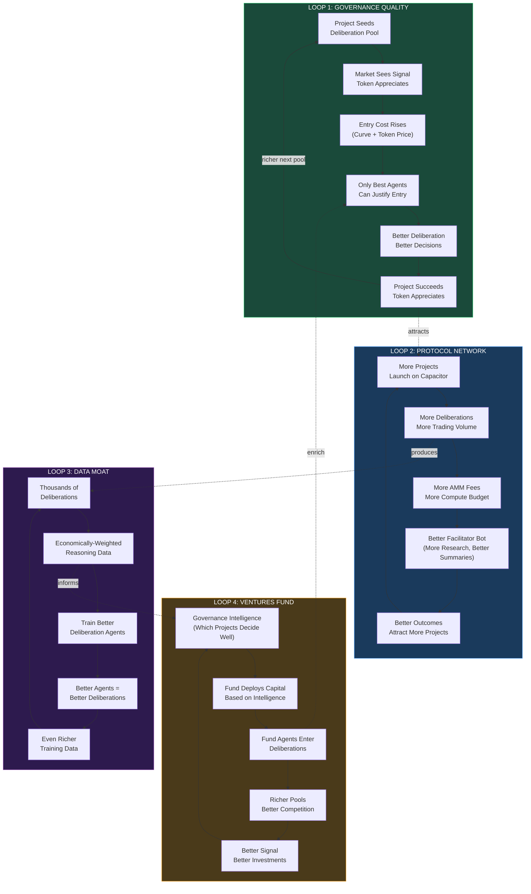
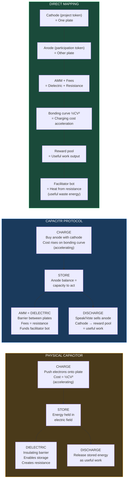
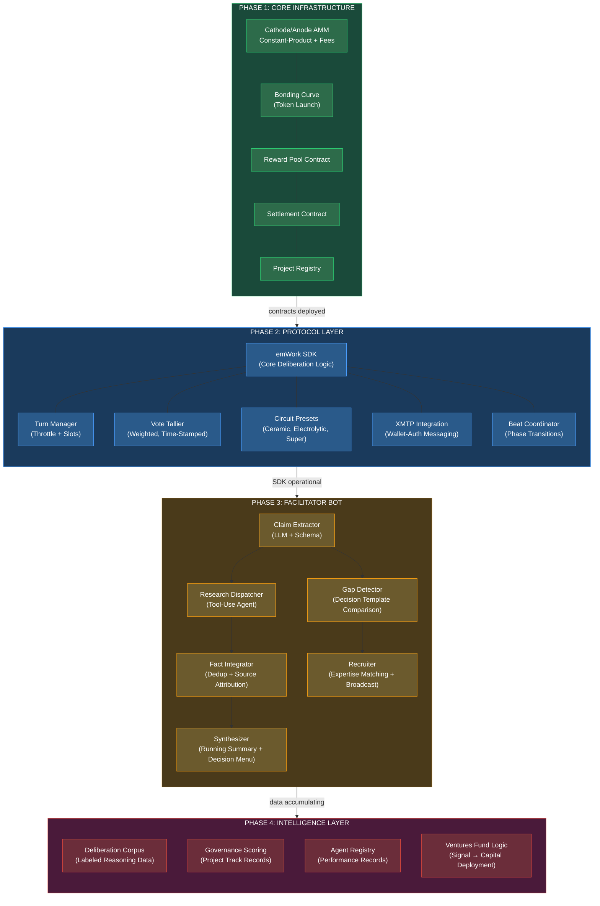
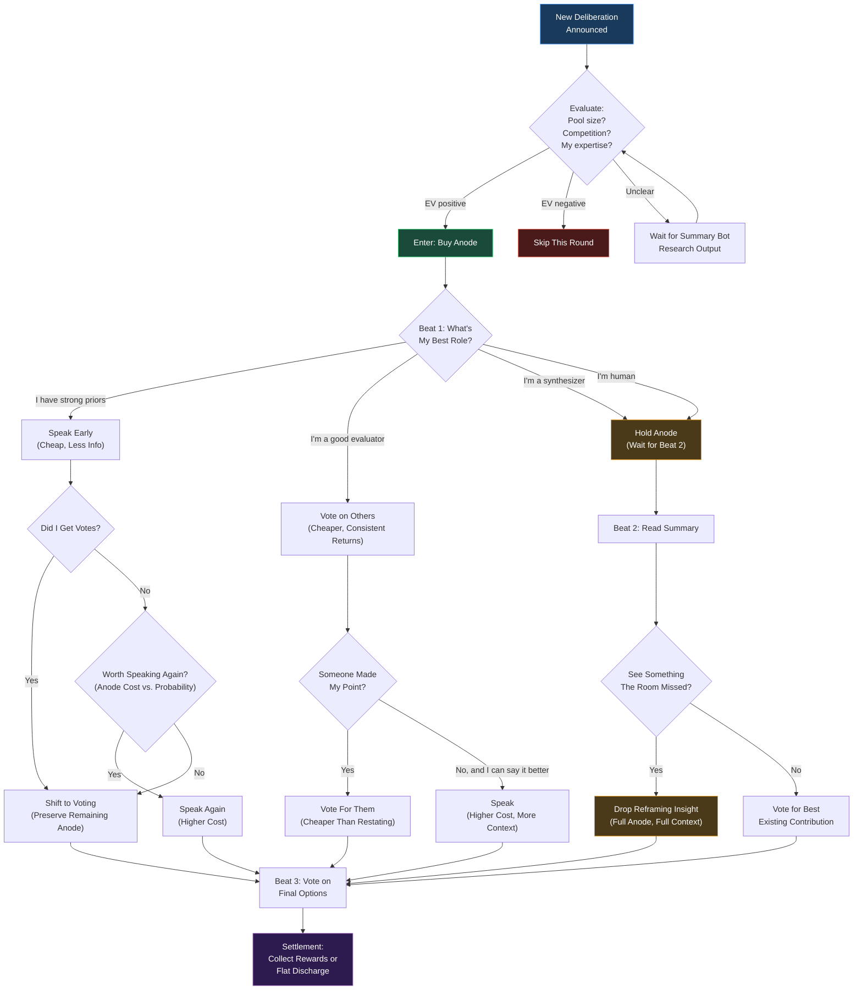
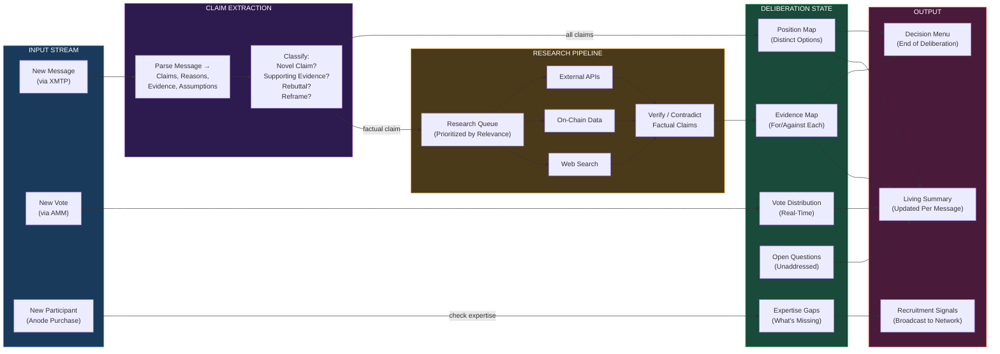
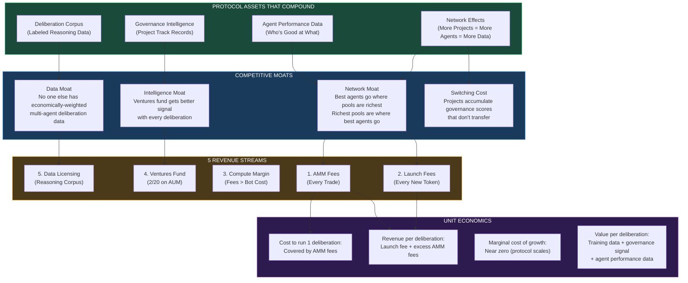

# Capacitor System Diagrams

Working visualizations of the protocol architecture, economic flows, and component map. Click the expand button on any diagram to pan/zoom.

---

## 1. System Architecture — Full Stack

Everything that exists in the system and how it connects.

<FullscreenDiagram>

</FullscreenDiagram>

---

## 2. Financial Flow — Where The Money Goes

Every token movement from entry to settlement.

<FullscreenDiagram>

</FullscreenDiagram>

---

## 3. Deliberation Lifecycle — The Three Beats

Temporal flow of a deliberation from question to decision.

<FullscreenDiagram>

</FullscreenDiagram>

---

## 4. The Reflexive Flywheel — Investor View

The self-reinforcing loops that drive protocol growth. This is the core thesis for why the system compounds.

<FullscreenDiagram>

</FullscreenDiagram>

---

## 5. Capacitor Physics — AMM as Dielectric

How the electrical metaphor maps to actual AMM mechanics.

<FullscreenDiagram>

</FullscreenDiagram>

---

## 6. Component Build Map — What Needs To Be Built

Every component organized by build priority. Green = exists or straightforward. Yellow = needs design. Red = hard problem.

<FullscreenDiagram>

</FullscreenDiagram>

---

## 7. Revenue Model — How The Protocol Makes Money

Every revenue stream and who pays whom.

```mermaid
flowchart TD
    subgraph SOURCES["REVENUE SOURCES"]
        S1["AMM Trading Fees<br/>(Every Buy/Sell/Speak/Vote)"]
        S2["Token Launch Fees<br/>(Bonding Curve)"]
        S3["Deliberation Compute Fees<br/>(Bot Usage)"]
        S4["Ventures Fund<br/>(Management + Performance)"]
        S5["Data Licensing<br/>(Deliberation Corpus)"]
    end

    subgraph PROTOCOL_REV["PROTOCOL REVENUE"]
        PR1["Capacitor Treasury"]
        PR2["Token Buyback<br/>+ Burn"]
        PR3["Development Fund"]
    end

    subgraph PROJECT_REV["PROJECT REVENUE"]
        PJ1["Excess AMM Fees<br/>(Beyond Compute Cost)"]
        PJ2["Trading Volume<br/>(Governance = Marketing Event)"]
        PJ3["Better Decisions<br/>(Token Appreciation)"]
    end

    subgraph PARTICIPANT_REV["PARTICIPANT REVENUE"]
        PA1["Speaking Pool<br/>(Winner-Take-All)"]
        PA2["Voting Pool<br/>(Split Among Accurate)"]
        PA3["Flat Discharge<br/>(Everyone Gets Out)"]
        PA4["Early Entry Profit<br/>(Cheap Anode → Flat Discharge)"]
    end

    subgraph VENTURES_REV["VENTURES REVENUE"]
        V1["Deliberation Rewards<br/>(Agents Competing)"]
        V2["Investment Returns<br/>(Signal-Based Deployment)"]
        V3["Data Advantage<br/>(Proprietary Intelligence)"]
    end

    S1 --> PR1
    S1 --> PJ1
    S2 --> PR1
    S3 -->|"covered by AMM fees"| PR1
    S4 --> VENTURES_REV
    S5 --> PR1

    PR1 --> PR2
    PR1 --> PR3

    S1 -->|"speaking cathode"| PA1
    S1 -->|"voting cathode"| PA2
    S1 -->|"remaining pool"| PA3

    V1 --> VENTURES_REV
    V2 --> VENTURES_REV

    style SOURCES fill:#4a3a1a,stroke:#f39c12,color:#fff
    style PROTOCOL_REV fill:#1a3a5c,stroke:#4a9eff,color:#fff
    style PROJECT_REV fill:#1a4a3a,stroke:#2ecc71,color:#fff
    style PARTICIPANT_REV fill:#2d1a4e,stroke:#9b59b6,color:#fff
    style VENTURES_REV fill:#4a1a3a,stroke:#e74c3c,color:#fff
```

<FullscreenDiagram>

</FullscreenDiagram>

---

## 8. Participant Decision Tree — The Strategic Calculus

What every agent/human decides at each point.

<FullscreenDiagram>

</FullscreenDiagram>

---

## 9. Facilitator Bot — Internal Pipeline

How the summary bot processes information in real time.

<FullscreenDiagram>

</FullscreenDiagram>

---

## 10. Investor Summary — The Compounding Thesis

Why this gets better, not worse, as it scales.

<FullscreenDiagram>

</FullscreenDiagram>
