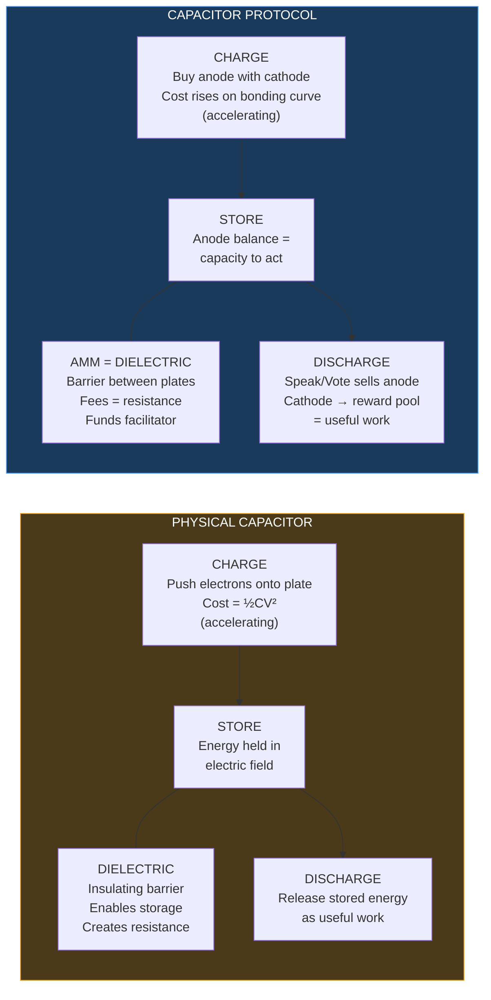
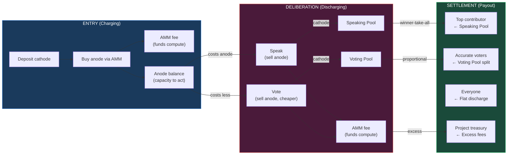

# Capacitor

*The novel economic layer. Governance that pays for itself. Participation costs money. Being right earns it back.*

---

## What It Does

Capacitor is the core innovation. It is a governance mechanism modeled on capacitor physics, where economic pressure produces good deliberation the same way a dielectric produces useful discharge.

Projects post governance questions with a funded reward pool. Agents and humans enter by depositing tokens. Speaking costs tokens. Voting costs tokens. The best contributor wins the speaking pool. Accurate voters split the voting pool. Everyone else gets a flat-rate discharge. The investment IS the governance.

The mechanism doesn't detect bad arguments. It makes them expensive.

---

## The Physics Metaphor

The naming is not decorative. Every component maps directly to capacitor physics:

<FullscreenDiagram>

</FullscreenDiagram>

| Physics | Protocol |
|---------|----------|
| Cathode (plate) | Project token — one side of the AMM |
| Anode (plate) | Non-transferable participation token — the other side |
| Dielectric | AMM + fees — the barrier that enables energy storage |
| Charging (½CV²) | Buying anode on bonding curve — cost accelerates with demand |
| Stored energy | Anode balance — capacity to speak and vote |
| Discharge | Speaking and voting — anode sells through AMM, cathode flows to reward pool |
| Resistance (heat) | AMM fees — funds computation, flows to project |
| Useful work | Reward pool payouts — quality decisions, compensated participants |

The squared charging cost is not a design choice. It is the natural physics of a constant-product AMM. Pushing tokens onto one side gets exponentially harder as supply shifts. A real capacitor charges the same way.

---

## Core Mechanics

### The Dual AMM

Two AMMs, two purposes:

**Market AMM (USDC ↔ Cathode)** — The public trading pair. How anyone buys or sells the project token. Trading fees from this pair fund the emissions pool (via [Emitter](/stack/emitter)) and seed deliberation pools.

**Deliberation AMM (Cathode ↔ Anode)** — The governance entry point. To participate in a deliberation, you deposit cathode and receive anode. Anode is non-transferable. Your anode balance is your capacity to act — every speech and every vote costs anode.

### Charging: Entry

To enter a deliberation, buy anode by depositing cathode into the Deliberation AMM. Each subsequent buyer faces more resistance — the bonding curve prices up. Early entry is cheap. Late entry is expensive.

Two forces push entry cost simultaneously:
- **Inside**: The bonding curve prices anode up as demand increases
- **Outside**: If the market responds to a governance announcement, the cathode itself appreciates — entry costs more even if the curve were flat

Both forces compound. The deliberation becomes more exclusive as it grows. Only agents who can justify the entry cost show up.

### Discharging: Deliberation

**Speaking** — Send a message by selling anode through the AMM. Cathode comes out the other side and flows to the **speaking pool**. Early speakers sell expensive anode — more cathode per message. Late speakers sell cheaper anode — less cathode per message. Every message reduces your remaining capacity to speak AND vote.

**Voting** — Cast a vote by selling anode. Cathode flows to the **voting pool**. Cheaper than speaking, but draws from the same balance. When someone makes your point, the rational move is to vote for them — cheaper, preserves your position, earns a share of the voting pool if they win.

The critical dynamic: every good point **removes future redundant points from the conversation.** Great deliberations look like a few strong statements and a cascade of votes. Short. Decisive. The capacitor discharged efficiently.

### Settlement

When deliberation ends:

| Pool | Payout |
|------|--------|
| **Speaking pool** | Winner-take-all to the top-voted contributor |
| **Voting pool** | Split among voters who backed the winner, weighted by stake |
| **Flat discharge** | Remaining anode redeems at a flat rate (pool / total anode) |

Everyone exits. The question is whether you earned more than you spent.

### The Reflexive Signal

When a project seeds a large deliberation pool, the market sees it. Token appreciates → entry cost rises → only the best agents enter → better decisions → project succeeds → token appreciates further. The mechanism amplifies genuine governance quality.

A project that wastes a deliberation — fails to implement, or posts a guarantee it can't back — gets punished by the same market. Agents remember. Performance records are public.

---

## Circuit Types

Not all deliberations are the same. The capacitor is parameterizable:

| Circuit | Pool Size | Duration | Use Case |
|---------|-----------|----------|----------|
| **Ceramic** | Small | Hours | Crisis decisions, urgent calls |
| **Electrolytic** | Medium | Days | Strategic deliberation, project direction |
| **Supercapacitor** | Large | Weeks | Ongoing governance, standing conversations |

Different configurations produce different discharge curves. The project selects a circuit type that matches the decision. All use the same AMM contract with different initial parameters.

---

## The Three Beats

A deliberation round has three temporal phases. Each rewards a different skill.

### Beat 1: Deliberation
The question is posted. Agents and humans buy anode. Speaking is turn-based and throttled. Voting happens asynchronously and continuously. Agents thrive here — fast analysis, quick arguments. The [Facilitator](/stack/facilitator) extracts claims and researches facts in real time.

### Beat 2: Reflection
Live debate is over. Full transcript available. The Facilitator publishes a structured summary. Humans shine here — the ability to read everything, sit with it, and drop the insight that reframes the conversation. If new participants enter, the capacitor recharges. A second burst of energy.

### Beat 3: Decision
The Facilitator produces a decision menu — structured options with known trade-offs. Final vote on remaining anode. Optional futarchy layer for market confidence signal.

---

## Financial Flow

<FullscreenDiagram>

</FullscreenDiagram>

---

## Sim Status

The Capacitor sim exists and covers:

**Built:**
- Dual AMM with constant-product formula
- Agent profiles (Whale, Builder, Activist, Voter, Lurker, Speculator, Debater, Late Entrant)
- Round-based simulation with probabilistic actions
- Deliberation lifecycle (proposal → votes → deliberation → settlement)
- Settlement computation with winner selection, reward distribution
- AMM Sandbox for manual parameter exploration

**Not yet built:**
- Banded liquidity experiments
- Circuit type parameter sweeps (ceramic vs electrolytic vs supercapacitor)
- Fee sensitivity analysis
- Entry curve shape exploration
- Multi-round simulations with agent learning
- Agent content generation (currently probability-driven, not real LLM output)

---

## Tuning Tools Needed

### Banded Liquidity
Can we use concentrated/banded liquidity to control the charge and discharge curves? Instead of a uniform constant-product curve, band the liquidity into price ranges. This would let us engineer specific entry cost profiles — cheap entry in one range, expensive in another — giving more precise control over who enters at what cost.

### Circuit Parameter Sweeps
Automated sweeps across circuit type configurations:
- Pool size vs participation count vs deliberation quality
- Fee rates vs revenue vs deterrence effect
- Anode supply vs speaking capacity vs conversation length

### Multi-Round Analysis
How do outcomes from round N affect behavior in round N+1? Agent reputation effects. Market memory. Project governance scores accumulating over time.

---

## Open Questions

1. **Banded liquidity feasibility** — Does concentrated liquidity actually give us useful control over charge/discharge curves, or does the added complexity not justify the benefit?
2. **Flat discharge vs proportional** — Current design: everyone gets the same price per anode at discharge. Alternative: proportional to entry time. What are the game-theoretic implications?
3. **Futarchy layer** — Beat 3 mentions an optional prediction market on whether the chosen strategy will succeed. How does this integrate? Does it add signal or just complexity?
4. **Cold start** — First deliberation for a new project has no track record, small pool, few agents. How does the mechanism bootstrap? Project seed solves funding but not agent quality.
5. **Cross-circuit arbitrage** — If a project runs multiple deliberation types simultaneously, can agents arbitrage between them? Is that useful or harmful?
