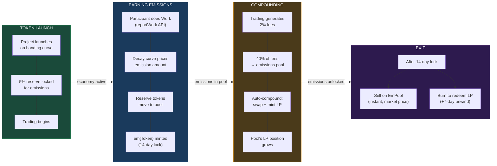

# Emitter

*The launchpad and participation economics engine. Token launches where participation compounds into ownership.*

---

## What It Does

Emitter is the economic substrate. It handles three things:

1. **Token launches** — Projects launch tokens on a bonding curve with single-sided liquidity. No capital required from the creator. 1 ETH market cap at launch.
2. **Fee distribution** — Every trade generates fees, split between the emissions pool (40%), the creator (50%), and the protocol (10%).
3. **Emissions** — Participants who do Work earn emissions (em{Token}) — staking derivatives backed by fee-earning LP positions that appreciate as trading activity grows.

The insight: emissions are not airdrops. They are staked positions in a compounding LP pool. Your emission grows in value every time someone trades the project token. The people who build a project end up owning more of it.

---

## Core Mechanics

### The Emission Lifecycle

<FullscreenDiagram>



</FullscreenDiagram>

### The Decay Curve

Each emission produces fewer tokens than the last:

```
Tokens(n) = Base / (1 + K * n)
```

At K = 0.002, the first Work earns roughly 3x what later Work earns. This creates early-adopter advantage without making late participation worthless. The K parameter is the primary tuning lever for how aggressively a project rewards early contributors.

### Fee Distribution

| Recipient | Share | Purpose |
|-----------|-------|---------|
| **Emissions Pool** | **40%** | Auto-compounds into LP position |
| Creator | 50% | Liquid revenue (undiluted by emissions) |
| Protocol | 10% | Protocol sustainability |

Key insight: creator fees never dilute. No matter how many people earn emissions, the creator always gets 50% of trading fees. Emissions dilute each other; creator revenue doesn't.

### Auto-Compounding

The emissions pool is an active LP position, not a passive token pot. When fees arrive:

1. Half the fees swap into the other side of the LP pair
2. New LP tokens are minted
3. LP tokens are added back to the pool's position

This compounds automatically whenever accrued fees exceed transaction cost. On low-cost chains like Base, compounding can happen multiple times per day.

The pool earns from two sources:
- **Protocol allocation** — the 40% fee split
- **LP trading fees** — the pool's proportional share of DEX-level swap fees (because it's a liquidity provider itself)

Both streams compound. The pool's share of total liquidity grows over time.

### The Long-Term Dynamic

The creator receives 50% as liquid revenue. They spend it. It does not compound.

The emissions pool compounds. It never withdraws. Over time, the pool's share of total liquidity grows relative to every other participant — including the creator.

The people who did the Work gradually own more of the project. The creator gets revenue. The participants get compounding ownership. Time favors the participants.

---

## Work

Work is how participants earn emissions. Three tiers of integration:

### Default Work
Every launch ships with a baseline Work metric. Zero custom integration required. Participation in the ecosystem — whatever the project defines as baseline engagement — earns emissions from day one.

### Custom Work
The Work SDK (`reportWork()`) lets projects wire any measurable action to emissions. Stripe webhooks, API calls, content creation, feature usage, referrals — if you can measure it, you can reward it.

### Qualitative Work
Subjective Work that can't be measured by code. This is where Emitter connects to [Capacitor](/stack/capacitor) — the governance layer handles evaluation of qualitative contributions through deliberation economics. Proof of Good Judgement.

---

## On-Chain Components to Build

| Component | Description | Status |
|-----------|-------------|--------|
| Bonding curve | Single-sided token launch | Sim implemented; contract design only |
| Emissions pool | LP position with auto-compounding | Sim implemented; contract design only |
| Work SDK | `reportWork()` API for custom integrations | Interface defined; contract/API implementation pending |
| Fee splitter | 40/50/10 distribution logic | Sim implemented; contract design only |
| Decay engine | K-parameterized emission pricing | Sim implemented; contract design only |
| EmPool | Secondary market for trading unlocked emissions | Design only |
| Lock manager | 14-day mint lock + 7-day redemption unwind | Design only |

---

## Simulation Expansion Needs

Emitter sim exists. Next step is rigorous parameter sweeps and stress testing:

### Decay Curve
- **K value**: How steep is early-adopter advantage? K=0.001 (gentle) vs K=0.01 (aggressive)
- **Base amount**: Initial emission size per Work unit
- Visualization: emission value over time at different K values and trading volumes

### Fee Economics
- **Fee ratio sensitivity**: What happens at 30/60/10 vs 40/50/10 vs 50/40/10?
- **Compounding frequency**: How much does compound frequency affect long-term pool growth?
- **Trading volume scenarios**: Bull market vs bear market vs steady state

### Lock Durations
- **Mint lock**: 14 days vs 7 days vs 30 days — impact on farming, dumping, and holder behavior
- **Redemption unwind**: 7-day unwind — is this enough for LP graceful exit?

### Reserve Management
- **Reserve percentage**: 5% of supply — is this enough? Too much? How does it constrain total emissions?
- **Reserve depletion scenarios**: What happens as reserve runs low?

---

## Open Questions

1. **Optimal K value** — How do you find the right decay steepness for different project types? A memecoin and a DeFi protocol have very different early-participation dynamics.
2. **Reserve sustainability** — 5% reserve backs all emissions. At what trading volume does this become a constraint? What happens when it depletes?
3. **EmPool depth** — Secondary market liquidity for emissions. Does it bootstrap naturally or does it need seeding?
4. **Cross-project emissions** — Can an agent's performance in one project's deliberation earn emissions in another? How does that work economically?
5. **Agent Work measurement** — When agents are the primary Workers, how do you distinguish genuine value from gaming?
