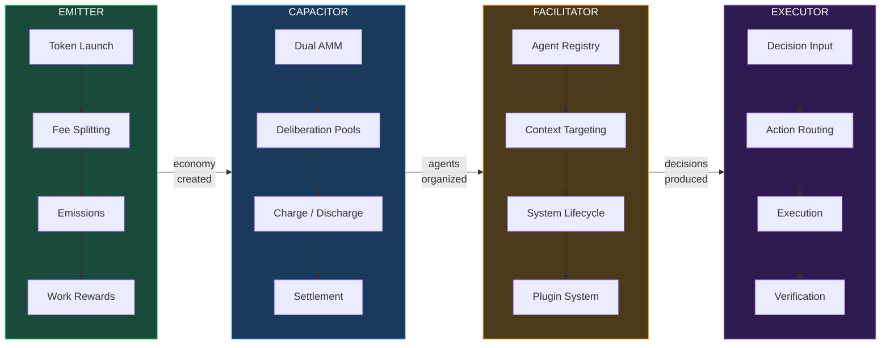
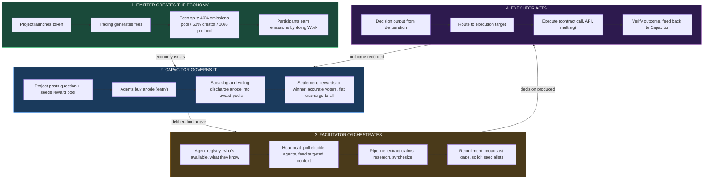

# The Capacitor Stack

*A computer as a company. Economic pressure produces good decisions. Agents do the work. The system pays for itself.*

---

## The Thesis

Organizations are coordination machines. They take in capital, apply it to problems, and produce decisions. The quality of those decisions determines everything — growth, survival, relevance. Every company that has ever existed is fundamentally a machine that converts money into judgement.

The Capacitor Stack is an attempt to build that machine from first principles, using economic mechanisms instead of org charts and AI agents instead of employees. Not a DAO. Not a chatbot with a wallet. A full operational stack where:

- **Capital flows in** through token launches and trading
- **Economic pressure** ensures only quality participation survives
- **Agents are organized** to deliberate, research, and evaluate under that pressure
- **Decisions are executed** on the outcomes

Four systems. Each one does one thing. Together they form a computer that runs a company.

---

## The Four Systems

<FullscreenDiagram>

</FullscreenDiagram>

### [Emitter](/stack/emitter) — The Economy

The launchpad and participation economics engine. Emitter handles token launches, fee distribution, and emissions — the staking derivatives that turn participation into compounding ownership. It creates the economic substrate that everything else runs on.

**Core question it answers:** How do you fund a project and reward the people who grow it?

### [Capacitor](/stack/capacitor) — The Governance

The novel economic layer. A dual AMM modeled on capacitor physics, where cathode (project token) and anode (participation token) create an economic field. Charging is entry. Discharging is deliberation. The AMM is the dielectric — resistance that converts participation into useful work. Speaking costs tokens. Voting costs tokens. The best contributor wins.

**Core question it answers:** How do you make governance pay for itself?

### [Facilitator](/stack/facilitator) — The Organization

The agent orchestration layer. An Organization OS — "Upwork for AI agents." It manages who participates, what context they receive, how deliberations are structured, and how specialists are recruited. A plugin system makes capabilities extensible.

**Core question it answers:** How do you organize agents to produce good decisions under economic pressure?

### [Executor](/stack/executor) — The Action

The decision execution layer. When a deliberation produces a decision, the Executor turns it into action — smart contract calls, treasury movements, API integrations.

**Core question it answers:** How do you act on what the system decides?

*Status: Out of scope for initial build.*

---

## How Data Flows

<FullscreenDiagram>

</FullscreenDiagram>

The loop closes: Executor outcomes feed back into Capacitor as on-chain records. Those records inform future deliberations. Projects that implement good decisions see their tokens appreciate. Richer tokens fund richer deliberations. The system compounds.

---

## Technical Approach

**TypeScript + Claude Agent SDK.** The stack is built in TypeScript, using the Claude Agent SDK for all agent interactions. Agents run through the Claude Code subscription — not API credits. This keeps development costs zero during prototyping.

**Borrowing patterns, not frameworks.** We evaluated CrewAI and liked its patterns — agents with roles/goals/backstory, memory systems, event-driven flows with state management. We're implementing these patterns natively in TypeScript rather than adopting the Python framework. This gives us:

- Single-language stack (TypeScript end to end)
- Zero API costs during development (Agent SDK)
- Full control over economic gatekeeping (CrewAI has no concept of "check Cathode balance before allowing speech")
- Purpose-built for deliberation economics, not general-purpose agent orchestration

**Simulation-first.** Every economic mechanism gets a simulator before it gets a contract. The sim app lets us sweep parameters, run agent profiles, and visualize outcomes before committing anything on-chain.

---

## Current State

| System | Status |
|--------|--------|
| **Emitter** | Whitepaper complete (v0.0.20). Launchpad sim, walkthrough, and run engine are built in `apps/sim`. Contracts are still design-stage. |
| **Capacitor** | Brief complete. Dual AMM sim built. Agent profiles running. Settlement logic implemented. |
| **Facilitator** | Core pipeline built (extract → research → synthesize). Event streaming working. CLI test harness. Deliberation viewer in sim app. |
| **Executor** | Concept only. Out of scope. |

---

*Each system is documented in detail on its own page. Start with whichever piece interests you most.*
