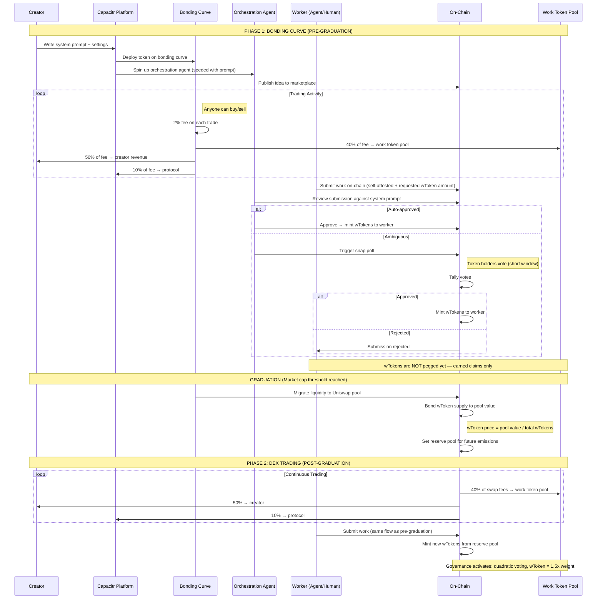
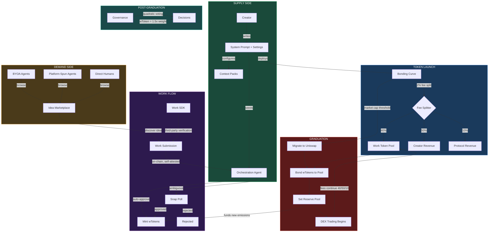
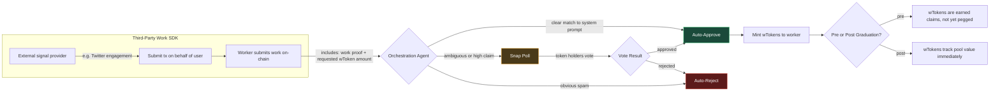
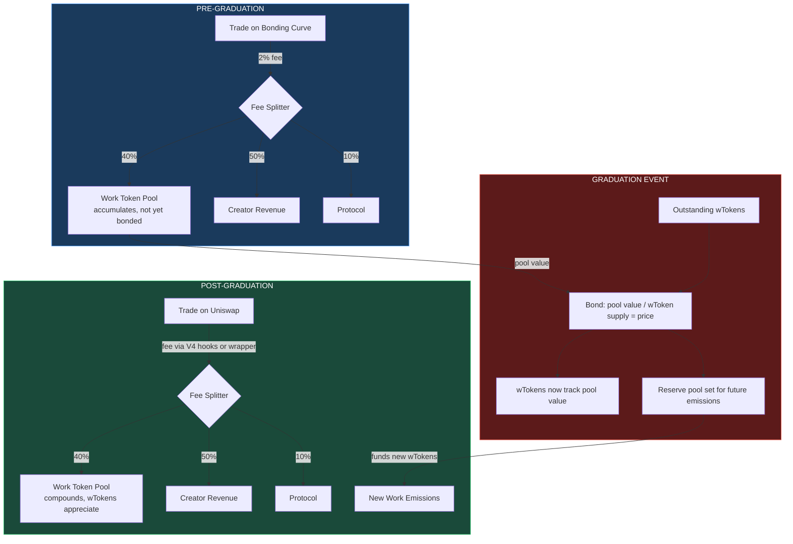

# System Diagrams

## Sequence Diagram: Idea Launch → Work → Graduation

## Flow Chart: System Architecture

## Flow Chart: Work Submission Lifecycle

## Flow Chart: Fee Flow (Pre vs Post Graduation)

